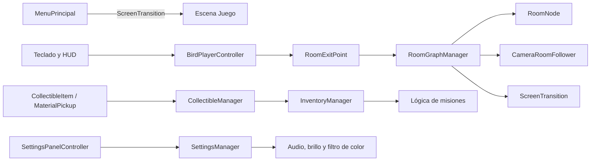

# Documentación técnica

## 1. Propósito y alcance

Este documento describe la implementación, configuración y mantenimiento de **Travesía a casa**. La presentación del juego, su objetivo educativo, controles y capturas se mantienen en el [README principal](../README.md).

| Documento | Responde principalmente |
|---|---|
| `README.md` | Qué es el juego, a quién está dirigido y cómo ejecutarlo. |
| `DocumentacionTecnica.md` | Cómo está construido, configurado y organizado el proyecto. |
| Encabezados y comentarios XML de los `.cs` | Qué responsabilidad tiene cada archivo, clase o método concreto. |

## 2. Resumen tecnológico

| Elemento | Uso en el proyecto |
|---|---|
| Unity `6000.5.1f1` | Motor y editor principal. |
| C# | Lógica del juego y herramientas de editor. |
| Unity 2D / Physics 2D | Renderizado, colisiones y movimiento top-down. |
| Input System `1.19.0` | Lectura de teclado y soporte de controles en pantalla. |
| Unity UI `2.5.0` | Menú, HUD, diálogos y configuración. |
| PlayerPrefs | Preferencias y registro simple de recolectables. |

La resolución de referencia configurada es **1920 x 1080**. El proyecto utiliza exclusivamente el Input System nuevo (`activeInputHandler = 1`).

## 3. Organización del proyecto

```text
Assets/
|-- Arte/                   Sprites, fondos y elementos de interfaz
|-- Editor/                 Utilidades ejecutadas solo dentro de Unity
|-- Escenas/                Escenas activas y prototipos
|-- Prefabs/                Objetos reutilizables
|-- Resources/              Recursos cargados en tiempo de ejecución
|-- Rooms/Bird/             Assets RoomNode_1 a RoomNode_9
|-- Scripts/
|   |-- Menu/               Menú, preferencias y accesibilidad
|   |-- Rooms/              Jugador, navegación, HUD y misiones
|   `-- ScreenTransition.cs Transiciones globales
`-- Shaders/                Efectos visuales
```

Los archivos generados por Unity (`Library`, `Temp`, `Logs`, `Builds` y soluciones del IDE) están excluidos mediante `.gitignore`.

## 4. Arquitectura general



La implementación se organiza por componentes de Unity. Los sistemas globales exponen una instancia única cuando necesitan coordinar objetos de distintas escenas o zonas.

## 5. Escenas y flujo de ejecución

| Orden de build | Escena | Responsabilidad |
|---:|---|---|
| 0 | `Assets/Escenas/MenuPrincipal.unity` | Entrada al juego y panel de configuración. |
| 1 | `Assets/Escenas/Juego.unity` | Mundo jugable, nueve rooms, jugador, cámara, HUD y misiones. |

Las escenas de `Assets/Escenas/prototipos/` se conservan como referencia y no forman parte de la compilación activa.

Flujo principal:

1. `SettingsManager` se crea antes de cargar la primera escena y permanece activo entre escenas.
2. `MainMenuController` solicita la carga asíncrona de `Juego` mediante `ScreenTransition`.
3. `RoomGraphManager` posiciona al jugador en el `RoomNode` inicial y notifica el cambio.
4. El jugador explora, interactúa y recoge objetos desde los componentes de la escena.
5. El HUD puede pausar la partida o regresar a `MenuPrincipal` usando la misma transición global.

## 6. Sistemas principales

### Navegación por rooms

El mundo se representa como un grafo de assets `RoomNode`. Cada nodo contiene un identificador, una posición en la escena y su lista de conexiones directas.

```text
[1] -- [2] -- [3]
        |
[6] -- [5]
        |
       [4]
        |
       [7] -- [8] -- [9]
```

| Componente | Responsabilidad |
|---|---|
| `RoomNode` | Define los datos y conexiones de cada room. |
| `RoomGraphManager` | Valida rutas, bloquea viajes simultáneos y actualiza la room activa. |
| `RoomExitPoint` | Detecta una salida y calcula la posición de llegada. |
| `CameraRoomFollower` | Centra y ajusta la cámara a la room actual. |
| `PlayerRoomBounds` | Mantiene al jugador dentro del área visible. |
| `ScreenTransition` | Cubre cambios de room y cargas asíncronas de escena con un fundido. |

Las conexiones deben configurarse en ambos sentidos para permitir el regreso entre rooms.

### Jugador e interfaz

| Componente | Responsabilidad |
|---|---|
| `BirdPlayerController` | Combina teclado y D-pad, y mueve el `Rigidbody2D`. |
| `BirdSpriteAnimator` | Selecciona cuadros de animación según movimiento y dirección. |
| `HudMoveButton` | Convierte eventos táctiles en direcciones de movimiento. |
| `GameHudController` | Coordina botones, pausa, audio y acciones de interacción. |
| `IntroTutorialController` | Presenta el flujo inicial de tutorial. |

### Recolección y misiones

| Componente | Responsabilidad |
|---|---|
| `CollectibleItem` | Representa un recolectable colocado en una room. |
| `CollectibleManager` | Evita recolecciones duplicadas y registra el estado persistente. |
| `InventoryManager` | Mantiene cantidades por tipo durante la partida. |
| `MaterialPickup` | Entrega materiales y muestra confirmación visual. |
| `MissionBird` | Controla la interacción y diálogo del personaje de misión. |
| `MissionIntroCutscene` | Ejecuta la introducción de la misión. |
| `MissionStatusPopup` | Muestra requisitos y progreso de materiales. |

`inventoryKey` debe coincidir entre el recolectable y los requisitos de la misión. Los identificadores `roomId + itemId` deben ser únicos.

### Configuración y accesibilidad

| Componente | Responsabilidad |
|---|---|
| `SettingsManager` | Almacena preferencias y emite el evento `Changed`. |
| `SettingsPanelController` | Sincroniza controles visuales con las preferencias. |
| `BackgroundMusicPlayer` | Mantiene la música y aplica el volumen de ambiente. |
| `BrightnessOverlay` | Representa el ajuste de brillo mediante una capa visual. |
| `ColorblindFilter` | Aplica el filtro de color configurado en cada escena. |

## 7. Estado y persistencia

`SettingsManager` utiliza estas claves de `PlayerPrefs`:

| Clave | Tipo | Valor inicial |
|---|---|---:|
| `settings_vol_ambiente` | `float` | `1` |
| `settings_vol_personajes` | `float` | `1` |
| `settings_vol_cinematica` | `float` | `1` |
| `settings_brillo` | `float` | `1` |
| `settings_modo_daltonico` | `int` booleano | `0` |
| `settings_vibracion` | `int` booleano | `0` |

Los recolectables se guardan como `collected_<roomId>_<itemId>` con valor `1`. El inventario mantiene sus conteos solo en memoria durante la partida actual.

Limitación actual: si se reinicia el juego, un objeto puede permanecer marcado como recogido mientras su conteo de inventario vuelve a cero. Antes de implementar guardado completo conviene unificar ambos estados en un único modelo persistente.

## 8. Configuración en Unity

Referencias esenciales que deben revisarse desde el Inspector:

- `RoomGraphManager`: `startingNode` y referencia al jugador.
- Cada `RoomNode`: identificador, posición y conexiones bidireccionales.
- Cada `RoomExitPoint`: `targetNode` y, cuando corresponda, `entryPoint`.
- `GameHudController`: panel de configuración y `UnityEvent` de Interactuar/Picotear.
- Recolectables: `roomId`, `itemId` e `inventoryKey` únicos y coherentes.
- Misiones: claves y cantidades requeridas por `MissionStatusPopup`.

`SettingsManager`, la música y el filtro de color se inicializan por código; no es necesario duplicarlos manualmente en cada escena.

## 9. Extender el contenido

### Agregar una room

1. Crea un asset desde **Create > Game > RoomNode** en `Assets/Rooms/Bird/`.
2. Asigna `roomId`, `testWorldPosition` y sus conexiones.
3. Agrega la conexión inversa en cada nodo vecino.
4. Crea el contenido visual de la room en la escena `Juego`.
5. Configura sus `RoomExitPoint` y valida ida, regreso y posición de entrada.

### Agregar un recolectable de misión

1. Crea o reutiliza un prefab con `CollectibleItem` o `MaterialPickup`.
2. Define un `itemId` único dentro de la room.
3. Usa una `inventoryKey` común para todos los objetos del mismo tipo.
4. Registra esa clave y cantidad en la configuración de la misión.
5. Comprueba recolección, retorno a la room y reinicio de la partida.

## 10. Mantenimiento y validación

- El encabezado de cada `.cs` documenta el archivo completo; `/// <summary>` documenta tipos y miembros concretos. No es necesario repetir el mismo texto en ambos niveles.
- Los scripts de `Assets/Editor/` no deben incluirse en lógica de runtime.
- `RoomData`, `RoomManager`, `RoomEdgeTrigger`, `CubePlayerController` y `Direction` pertenecen al prototipo cardinal anterior. Deben mantenerse aislados del flujo principal mientras sigan como referencia.
- Actualmente no hay pruebas automatizadas bajo `Assets`; los cambios deben validarse en modo Play.

Lista mínima de comprobación antes de integrar cambios:

1. Abrir `MenuPrincipal` y entrar a `Juego` sin errores en consola.
2. Recorrer una conexión de room en ambos sentidos.
3. Verificar teclado y D-pad antes y después de una transición.
4. Recoger un objeto, volver a la room y confirmar que no reaparece.
5. Abrir y cerrar configuración desde menú y HUD.
6. Confirmar que brillo, audio y modo daltónico sobreviven al cambio de escena.
