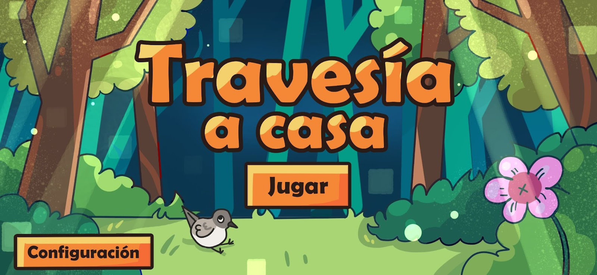

# Travesía a Casa



Juego 2D top-down **educativo** hecho en **Unity 6 (6000.5.1f1)**.
Controlas a un **yal austral**, un pajarito del sur de Chile que quedó
varado a miles de kilómetros de su hogar y tiene que encontrar la forma
de volver, recorriendo zonas conectadas —las *rooms*— y recolectando
materiales.

## Objetivos del proyecto

- Enseñar a los niños el **patrimonio natural del Parque Nacional
  Bosque Fray Jorge**.
- Lograr que entiendan la **importancia del medio ambiente** y el
  respeto por la flora y fauna.
- Usar la **gamificación** para crear un videojuego lúdico y educativo.

**Público objetivo:** niños y niñas de **1.° a 4.° básico de la Región
de Coquimbo**. Se eligió este rango porque en esos cursos se enseña
flora y fauna según las bases curriculares del Mineduc:

> "Se busca que por medio de la observación directa conozcan a los
> seres vivos, describan sus características, reconozcan sus ciclos de
> vida y describan el modo en que obtienen alimento y energía. Esto les
> permitirá tomar conciencia de la noción de ecosistema y de las
> consecuencias de sus propias acciones en el equilibrio de este."

**Trama:** el yal austral llega accidentalmente al Parque Fray Jorge y
tiene que buscar una forma de volver a su hogar.

## Historia (Capítulo 1)

Un castor roe la base del árbol del yal austral y su nido cae destruido.
Antes de poder reaccionar, unos humanos lo atrapan en una caja y se lo
llevan en un auto; el yal logra escapar por una ventana abierta, vuela
entre vientos costeros y neblina densa hasta caer agotado en un
matorral.

Despierta en el **Parque Nacional Bosque Fray Jorge** (Región de
Coquimbo, norte chico), lejísimos de su hogar en **Magallanes**. Ahí
conoce al **carpinterito**, un pájaro sabiondo que le explica dónde
está, qué es un parque nacional (un área natural protegida de la
intervención humana) y de qué depredadores cuidarse (el aguilucho y el
tucúquere). El carpinterito promete idear un plan para ayudarlo a
volver a casa… pero no piensa con el estómago vacío.

**Gameplay del capítulo 1 (tutorial):** el yal explora una parte de la
zona árida del parque buscando comida para el carpinterito. Puede
recoger **semillas, insectos, lombrices, una tapa de botella, un
caracol, un brote, un pastel mordido y una flor con néctar**. La idea
es que el niño recoja todas las opciones para que después el
carpinterito le explique qué puede comer y qué no: no todas las aves
tienen la misma alimentación, y hay elementos contaminantes (basura de
humanos) que son nocivos para ellas.

> Contenido curricular: alimentación de los seres vivos y clasificación
> de los animales según su alimentación (texto escolar, págs. 170 y 172).

## Cómo jugar

- **Mover:** WASD / flechas, o el D-pad del HUD (táctil).
- **Cambiar de room:** camina hacia una salida en el borde de la room;
  el cambio es instantáneo (sin transición) y la cámara queda fija
  centrada en la room nueva.
- **Interactuar / Picotear:** botones del HUD (por ahora disparan
  UnityEvents; la lógica de cada room se engancha desde el Inspector).
- **Configuración:** ruedita del HUD o `Escape` — pausa el juego
  (`Time.timeScale = 0`) y abre el panel de brillo/opciones.

## Sistema de rutas (rooms)

El mundo no es un mapa continuo: es un **grafo de rooms**. Cada room es un
`RoomNode` (ScriptableObject en `Assets/Rooms/Bird/`) con:

| Campo | Qué es |
|---|---|
| `roomId` | Id de la room según el boceto (1–9) |
| `testWorldPosition` | Centro de la room en la escena (grilla de 20×10 unidades) |
| `connections` | Lista de rooms conectadas (bidireccional: siempre se puede volver) |

### Mapa de rutas actual

```
[1 Nido] — [2] — [3]
            |
   [6] --- [5]
            |
           [4]
            |
           [7] — [8] — [9]
```

- Se **empieza en la room 1**, donde está el nido.
- La room 5 es el cruce principal: conecta con 2, 4 y 6.
- El camino largo baja por 4 → 7 y sigue al este hasta la 9.
- Las conexiones no tienen que ser cardinales: el grafo admite salidas
  en cualquier ángulo, tal como en el boceto.

### Cómo funciona un cambio de room

1. `RoomExitPoint` (trigger en el borde de la room) detecta que el
   jugador lo pisa moviéndose **hacia afuera** (chequeo de dirección,
   así no te teletransporta al pasar por al lado).
2. Llama a `RoomGraphManager.TravelTo(roomDestino, puntoDeEntrada)`,
   que valida que la room destino esté en `connections` de la actual.
3. El jugador se **teletransporta al punto de entrada** de la room nueva
   (sin deslizamiento ni fundido a negro).
4. `RoomGraphManager` dispara el evento `NodeChanged`; con eso:
   - `CameraRoomFollower` fija la cámara en el centro
     (`testWorldPosition`) de la room nueva, y
   - `RoomTransitionUI` actualiza la etiqueta "Room N" del HUD.

### Agregar una room nueva

1. Crear el asset: clic derecho → `Game > RoomNode` en
   `Assets/Rooms/Bird/`, poner `roomId` y `testWorldPosition`
   (respetando la grilla de 20×10).
2. Agregarla a `connections` de sus rooms vecinas (y viceversa).
3. En la escena `Juego`, crear el contenido de la room bajo un objeto
   `Room_N` y poner los `RoomExitPoint` en los bordes, apuntando su
   `targetNode` y el punto de entrada correspondiente.

## Escenas

| Escena | Qué es |
|---|---|
| `Assets/Escenas/MenuPrincipal.unity` | Menú principal: Jugar (carga "Juego" por nombre) y Configuración |
| `Assets/Escenas/Juego.unity` | El juego: las 9 rooms, el yal, HUD y cámara |
| `Assets/Escenas/prototipos/GraphPrototype.unity` | Prototipo viejo del grafo con el cubo — **usa API antigua y da error en Play**; se conserva solo como referencia |
| `Assets/Escenas/prototipos/SampleScene.unity` | Escena de ejemplo de Unity, sin uso |

## Estructura del proyecto

```
Assets/
├── Arte/
│   ├── boceto/            # Bocetos de los caminos/rooms
│   ├── juego/             # Sprites in-game
│   │   └── yal_animaciones/   # Frames del yal (idle_lado, avanzar, idle_frente, giro...)
│   ├── menu/              # Fondo, título y botones del menú
│   └── configuracion/     # Panel de configuración (sliders, botones)
├── Escenas/               # MenuPrincipal, Juego y prototipos/
├── Editor/                # Utilidades de menú (ver abajo)
├── Rooms/Bird/            # RoomNode_1 … RoomNode_9 (el grafo de rutas)
└── Scripts/
    ├── Menu/              # MainMenuController, SettingsManager, brillo
    └── Rooms/             # Todo el sistema de rooms, jugador y HUD
```

## Scripts principales

### Rooms y rutas
- **`RoomNode.cs`** — ScriptableObject de cada room (id, posición, conexiones).
- **`RoomGraphManager.cs`** — Singleton que lleva la room actual, valida
  los viajes por el grafo y emite `NodeChanged`.
- **`RoomExitPoint.cs`** — Trigger de salida con chequeo de dirección.
- **`CameraRoomFollower.cs`** — Cámara fija: en cada frame se planta en el
  centro de la room actual (nunca se sale de la room).
- **`RoomTransitionUI.cs`** — Etiqueta "Room N" del HUD.

### Jugador
- **`BirdPlayerController.cs`** — Movimiento con Input System nuevo
  (teclado + D-pad del HUD), voltea el sprite según la dirección.
- **`BirdSpriteAnimator.cs`** — Animación por código (sin Animator):
  alterna arrays de sprites idle/movimiento según la velocidad del
  Rigidbody2D, a 8 fps.

### HUD y recolección
- **`GameHudController.cs`** — D-pad, botones Interactuar/Picotear
  (UnityEvents) y apertura del panel de configuración con pausa.
- **`CollectibleItem.cs` / `CollectibleManager.cs`** — Objetos
  recolectables por room (flor con néctar, tapa de botella, caracol…);
  recuerdan si ya fueron recogidos.
- **`InventoryManager.cs`** — Inventario por conteo ("recolecta N
  materiales") con evento `ItemCountChanged`.

### Menú
- **`MainMenuController.cs`** — Botones Jugar/Configuración.
- **`SettingsManager.cs` + `BrightnessOverlay.cs`** — Ajuste de brillo
  persistente aplicado con un overlay.

### Legacy (del prototipo del cubo)
`RoomData.cs`, `RoomManager.cs`, `RoomEdgeTrigger.cs`,
`CubePlayerController.cs` y `Direction.cs` son de la primera versión con
grid cardinal (N/S/E/O). Solo los usa `GraphPrototype.unity`.

## Utilidades de editor (menú `Game` en Unity)

| Menú | Qué hace |
|---|---|
| `Game > Asignar animaciones del Yal` | Agrega `BirdSpriteAnimator` al Player de la escena abierta y le asigna los frames de `Arte/juego/yal_animaciones` sin arrastrar sprites a mano |
| `BuildMenuScene` | Reconstruye la escena del menú principal con el arte de `Arte/menu` |
| `SettingsPanelBuildUtils` | Arma el panel de configuración (sliders y botones de `Arte/configuracion`) |

## Requisitos

- Unity **6000.5.1f1** (Unity 6).
- Paquete **Input System** (el proyecto usa `Keyboard.current`, no el
  Input Manager viejo).

Abrir la carpeta del proyecto con Unity Hub y dar Play en
`Assets/Escenas/MenuPrincipal.unity`.
