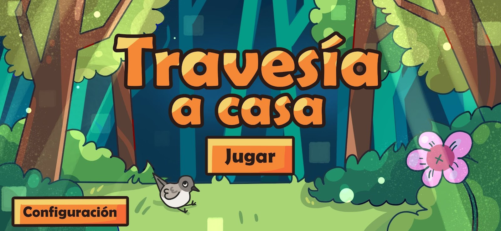
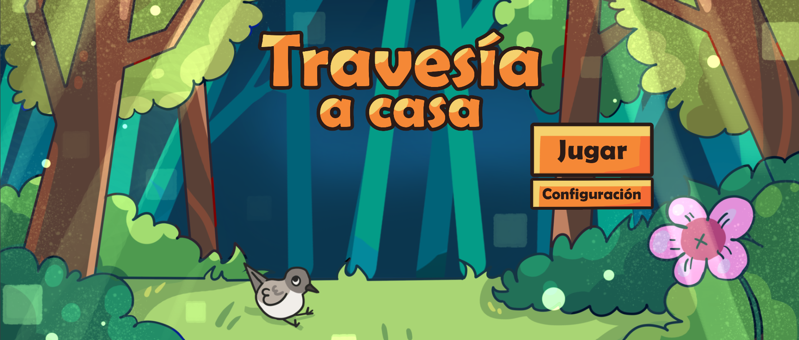
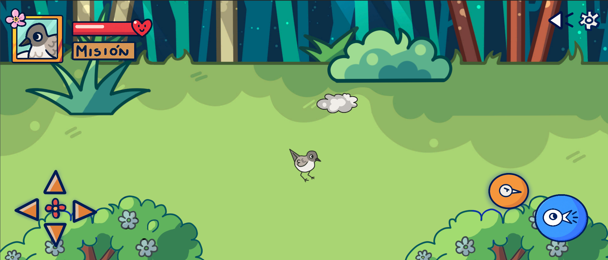
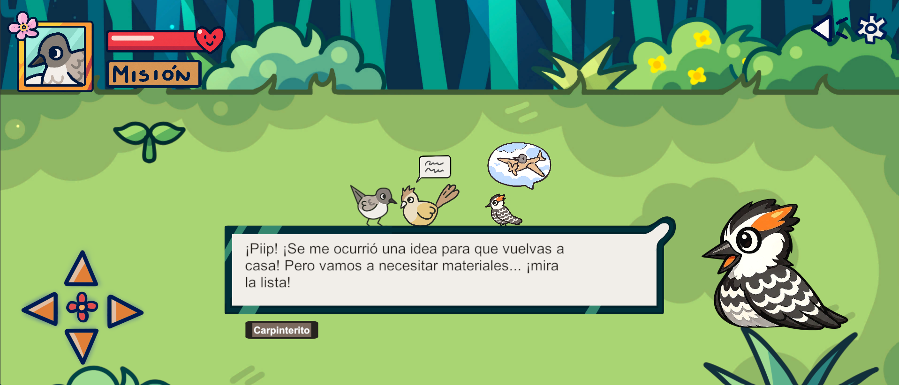
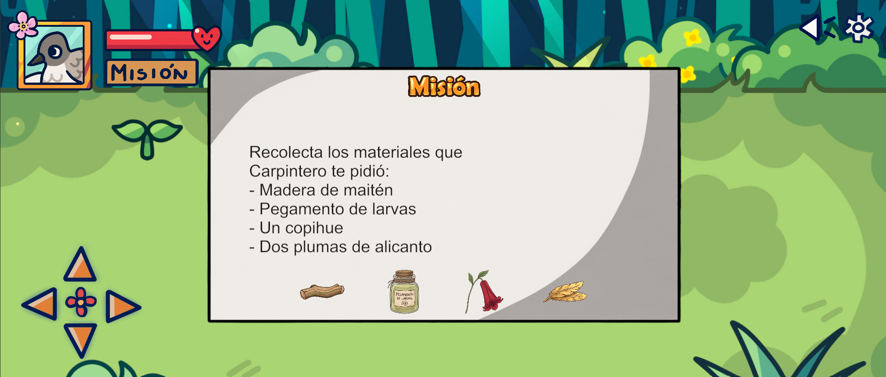
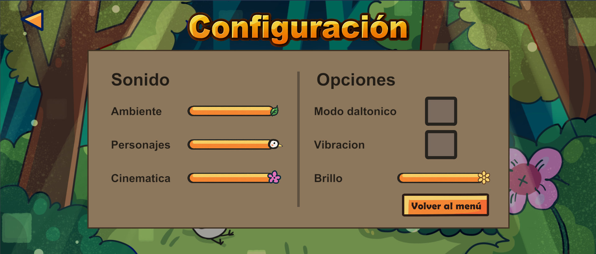

  <h1>Travesía a casa</h1>
  
<strong>Una aventura educativa 2D inspirada en el Parque Nacional Bosque Fray Jorge</strong>

  

    
    
    
  

## Sobre el juego

**Travesía a casa** es un videojuego educativo de exploración en el que el jugador controla a un yal austral que, tras quedar lejos de su hogar, debe recorrer el Parque Nacional Bosque Fray Jorge para encontrar el camino de regreso.

La experiencia combina exploración, conversaciones, recolección de materiales y pequeñas misiones para acercar a niños y niñas al patrimonio natural de la Región de Coquimbo.

> Explorar, aprender y cuidar el entorno también forman parte del viaje.

## Propósito educativo

El proyecto está dirigido principalmente a estudiantes de **1.º a 4.º básico** y busca:

- Dar a conocer la flora, fauna y valor natural del Parque Nacional Bosque Fray Jorge.
- Promover el respeto por los ecosistemas y la vida silvestre.
- Reforzar el aprendizaje mediante una experiencia lúdica e interactiva.

## Experiencia de juego

- Exploración de nueve zonas conectadas.
- Movimiento con teclado y controles táctiles en pantalla.
- Diálogos con personajes y misiones de recolección.
- Objetos persistentes que no reaparecen después de ser recogidos.
- Configuración de sonido, brillo, vibración y modo daltónico.
- Transiciones suaves entre escenas y zonas del mapa.

## Vista de la app

### Menú principal

### Exploración del parque

### Diálogo con el carpinterito

### Estado de la misión

### Configuración y accesibilidad

## Controles

| Acción | Teclado | Pantalla táctil |
|---|---|---|
| Moverse | `WASD` o flechas | D-pad |
| Interactuar | Sin tecla asignada | Botón Interactuar |
| Picotear | Sin tecla asignada | Botón Picotear |
| Configuración | `Escape` | Botón de ajustes |

## Ejecutar el proyecto

### Requisitos

- Unity **6000.5.1f1**.
- Módulo de compilación correspondiente a la plataforma de destino.

### Inicio rápido

1. Clona o descarga este repositorio.
2. Abre su carpeta raíz desde Unity Hub con la versión indicada.
3. Abre `Assets/Escenas/MenuPrincipal.unity`.
4. Presiona **Play**.

Las escenas incluidas en la compilación son `MenuPrincipal` y `Juego`.

## Documentación

- [Referencia técnica en Markdown](Docs/DocumentacionTecnica.md): consulta rápida para el equipo.

---

  Proyecto educativo desarrollado en Unity y ambientado en el patrimonio natural de Chile.

